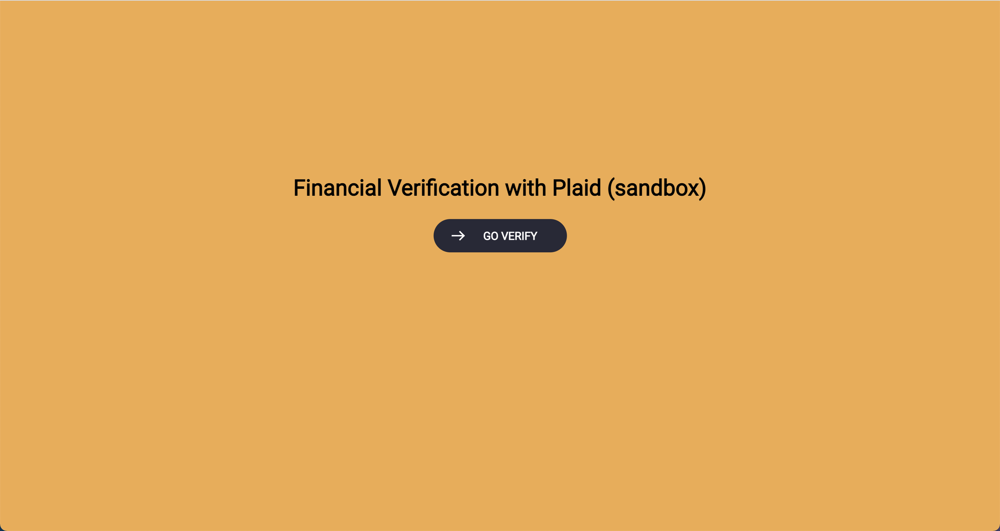
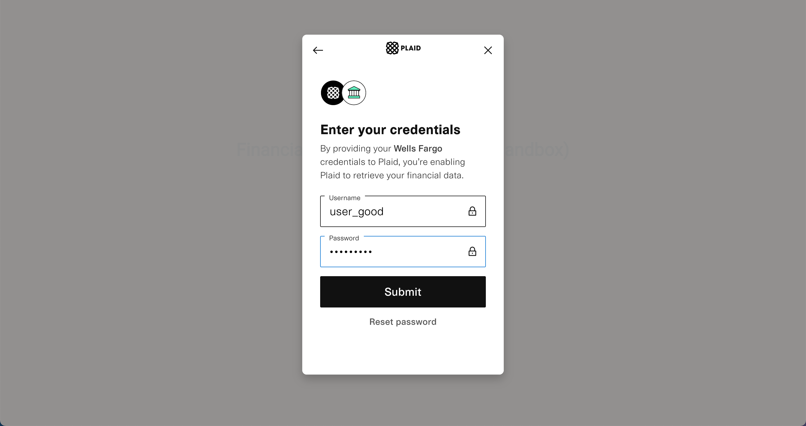
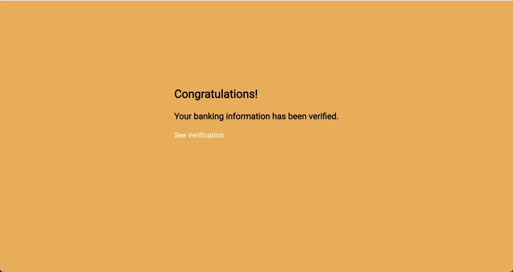
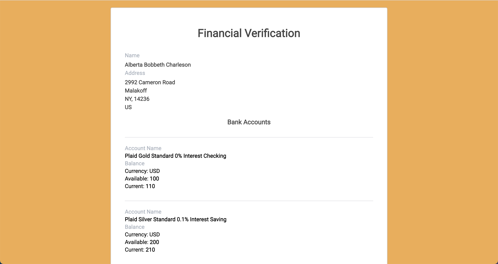

  <h1>Fin Verify with Plaid (Sandbox)</h1>
  <a href="https://fin-verify.herokuapp.com/">fin-verify.herokuapp.com (sandbox)</a>
  
username: user_good; password: pass_good;

A Financial Verification prototype using Plaid.

This prototype App solves the pain of needing to print out bank statements to prove financial capabilities for situations such as applying for a new apartment, DMV identify proof and VISA applications. 

Individuals can use this App to get a financial verification by linking to their bank, and institutions such as Apartment leasing offices or Embassies can then use the provided link to retrieve the financial verification.

## Developer Instructions

- Go to [Plaid](https://plaid.com/) to get free API credentials, and then update the credentials in /plaid/plaid.js 
- Go to [AWS DynamoDB](https://aws.amazon.com/dynamodb) to create a table called "income_verification" with a key *user_id*, and then update the credentials in /database/awsDynamoDB.js
- Downloda this repository, CC into the top level directory
- Run *npm install*
- Run *node app.js*
- Go to localhost:3000 on your browser

## Main Technologies
- **Plaid**: Fin Tech API to retrieve banking information
- **Node.js, Express, EJS**: Full stack web-development
- **AWS DynamoDB**: Cloud storage for data
- **Heroku**: Website Hosting
- **Github**: Git and Deployment

## Screenshots

Landing Page|Link to a bank with Pliad
:-------------------------:|:-------------------------:
|

|Verified|Financial Verification Result
:-------------------------:|:-------------------------:
|
